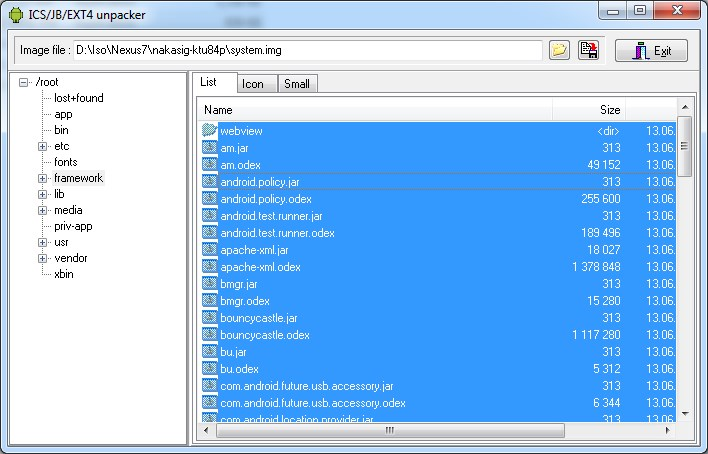
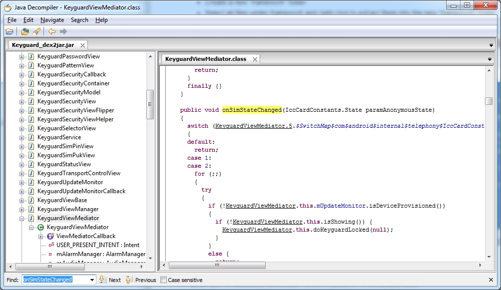

# Decompile .apk / .odex to .java in Nexus image

1. Get Nexus Image  
<https://developers.google.com/android/nexus/images>

2. Extract .apk / .odex and `/system/framework` folder from `system.img` using [Ext4 Unpacker](http://sourceforge.net/projects/androidicsjbext/)

  * Extract .apk / .odex you want to decompile
  * Extract /system/framework
      * Create a new "framework" folder
      * Select all files under framework and right click to extract them into the new "framework" folder.  
      
 
3. Convert .odex file into Smali format files using [baksmali](https://bitbucket.org/JesusFreke/smali/downloads)  

  * goto the folder contains .odex  
  * `java -jar xx\baksmali-2.0.3.jar -d xx\framework -x xx\sample.odex`
        *  -d framework is the folder extracted via Ext4 Unpacker
        *  You'll find a new `out` folder contains .smali files.
    
4. Bind all smali files to .dex file via [smali](https://bitbucket.org/JesusFreke/smali/downloads)  

  * goto the folder contains `out` created by baksmali
  * `java -jar xx\smali-2.0.3.jar -o sample.dex out`

5. Convert .dex to .jar via [dex2jar](https://code.google.com/p/dex2jar/downloads/list)

  * goto the folder contains .dex
  * `xx\dex2jar\dex2jar.bat sample.dex`
      * You'll get a .jar in the same folder

6. Decompile .jar to .java via [jd-GUI](http://jd.benow.ca/)

  * Select the .jar file and open it. Then you can see the source files.  
  

For convience, here're the [tools](./tools):  
Ext4 Unpacker, baksmali, smali, dex2jar, jd-GUI

For more, see:  
<http://javakorea.blogspot.com/2013/09/odex-decompilation.html>

