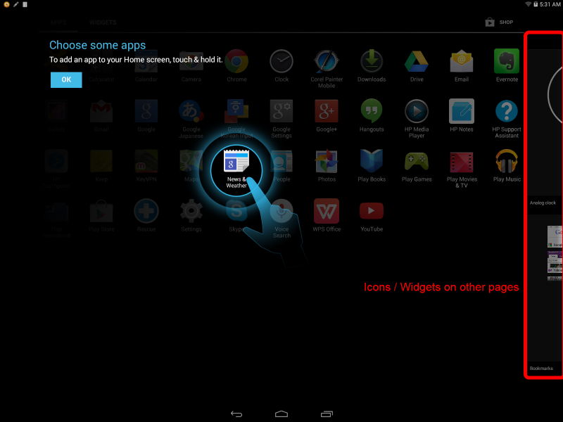
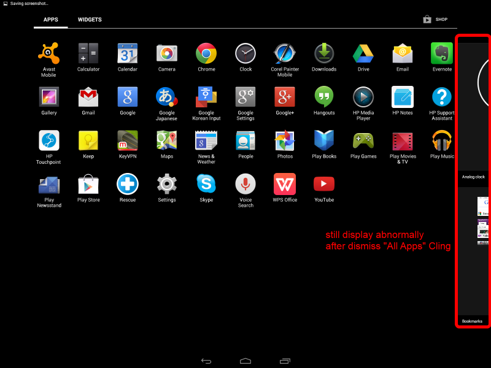

# All apps show abnormally after dismiss cling

The first time click on "All Apps" button, it'll show Launcher's "All Apps Cling".  
After dismiss the cling and wait for a while, you'll find some icons / widgets are dispalyed abnormally(icons or widgets on other pages will displayed partially on current page).  

All Apps Cling  

After Dismiss Cling  

* How to Fix:  
Force page to do updatePageCounts() and invalidateOnDataChange() after users dismiss "All Apps" cling.  

  * `packages/apps/Launcher2/src/com/android/launcher2/src/com/android/launcher2/AppsCustomizePagedView.java`:  
            
            // Step 1. Add new forceUpdatePageCountsAndInvalidateData()
            public void forceUpdatePageCountsAndInvalidateData() {
                updatePageCounts();
                invalidateOnDataChange();
            }

  * `packages/apps/Launcher2/src/com/android/launcher2/src/com/android/launcher2/AppsCustomizeTabHost.java`:

            // Step 2. Add new forceReset()
            public void forceReset() {
                mAppsCustomizePane.forceUpdatePageCountsAndInvalidateData();
            }

  * `packages/apps/Launcher2/src/com/android/launcher2/src/com/android/launcher2/Launcher.java`:

            public void dismissAllAppsCling(View v) {
                Cling cling = (Cling) findViewById(R.id.all_apps_cling);
                dismissCling(cling, Cling.ALLAPPS_CLING_DISMISSED_KEY, DISMISS_CLING_DURATION);
                // Step 3. Reset AppsCustomizeTab after dismiss All Apps Cling
                mAppsCustomizeTabHost.forceReset();
            }
