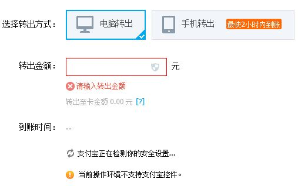

# Using Zhifudun(by iTrusChina) on Win10

#### Solution
1. Download and install [latest driver of Zhifudun](http://www.itrus.com.cn/alipay/download.html).
2. Use IE 11 to open alipay.com.
3. Press `F12` to open developer tools.
   * Set `Document Mode` to `10`.
   * Set `User Agent String` to `Internet Explorer 10`

     

   * Press `F5` to refresh page
4. Zhifudun will work now.

---------------

# 在Win10上使用支付盾（天威诚信）

#### 解决方案
1. 从天威诚信官网下载安装[最新版本的支付盾驱动](http://www.itrus.com.cn/alipay/download.html)。
2. 使用IE 11打开支付宝网站。
3. 按下`F12`打开开发者工具。
   * `文档模式`设置为`10`
   * `用户代理字符串`设置为`Internet Explorer 10`

      

   * 按`F5`刷新页面
4. 支付盾现在应该可以正常工作了
