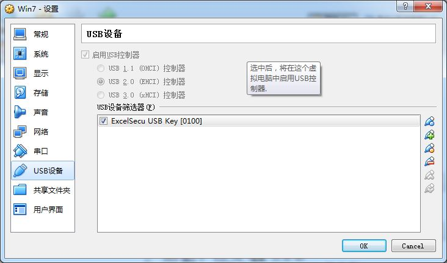
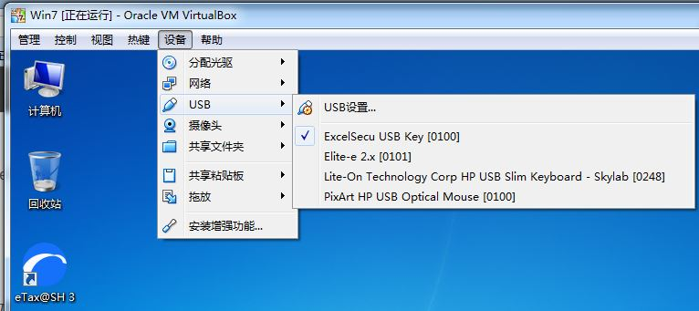

# eTax@SH 3(网上电子申报)更新失败的解决方法

#### 问题
* 电脑IP突然变成`169.254.x.x`后不能上网(实际原因是损坏的网线造成访问DHCP失败，自动获得微软保留地址)
* eTax@SH 3运行需要验证版本和升级，失败。
* 后来重新正常`192.168.1.x`后可以正常上网
* eTax@SH 3运行每次要验证版本和升级，依然失败。
* 提示“更新软件失败。进入软件后不能填写和发送。

   

#### 已经尝试的失败的解决方法
* 自己尝试重置网络依然失败
   * `netsh ip reset`（管理员命令行）
   * `netsh winsock reset`（管理员命令行）
   * 重启电脑后还是升级失败

* 进入软件后点击“服务热线”，拨打后官方给出了先备份数据然后重新安装导入数据的解决方法，但是失败。

   1. 备份数据
     * 方法1：复制 “计算机”->“文档”->“eTaxSH3”->`etax3.dat`。
     * 方法2：进入软件->“菜单”->“工具”->“数据备份”->备份为zip文件。

   2. 卸载eTax@SH 3
       “控制面板”->“卸载软件”->“eTax3.0”

   3. 删除先前安装的eTax@SH 3的文件夹，默认为`C:\eTax@SH`

   4. 重新安装eTax@SH3
   5. 将备份的`etax3.dat`覆盖至：“计算机”->“文档”->“eTaxSH3”（或者进入软件后“菜单”->“工具”->“数据恢复”->之前的zip文件）
   6. 运行软件看是否正常（实际依然失败）

#### 解决方法
* 方法1：在新的电脑上新安装eTax@SH 3/“证书助手”，导入备份数据`etax3.dat`后成功
* 方法2：原电脑上安装VirtualBox虚拟机
   *  VirtualBox网络设置成**“桥接网卡”** 
   * VirtualBox的**USB设备**添加“USB数字证书”（俗称U棒）
     * USB的数字证书的名字像这样：`execlSecu USB Key [0100]`
       
        
     * 添加好后**重启**虚拟机
     * VirtualBox的菜单->“设备”->“USB”->勾选添加的USB数字证书
        

   * 安装“证书助手3.0”后即可找到USB数字证书
   * 安装eTax3@SH，导入备份数据`etax3.dat`
   * 升级成功

#### 参考链接
* [IP Address has been assigned to 169.254.x.x and Can not Connect to Internet](https://github.com/northbright/Notes/blob/master/network/ip-address-has-been-assigned-to-169-254-x-x-and-can-not-connect-to-internet.md)
