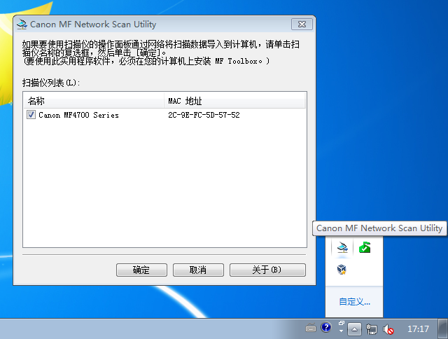
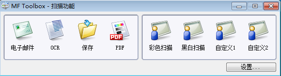
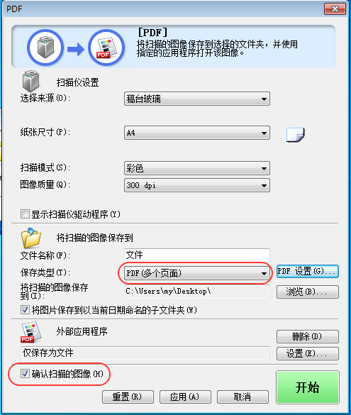

# Scan to PDF Using Canon MF4720w

#### Solution
1. Download and Install Drivers

  * [[Windows 64位] imageCLASS MF4770n/MF4720w MF打印机驱动程序 (UFR II / FAX / ScanGear)](http://support-cn.canon-asia.com/contents/CN/ZH/0100455501.html)
  * [[Windows 32位 & 64位] Tool Box 版本 4.9.1.1.mf18](http://support-cn.canon-asia.com/contents/CN/ZH/0200156601.html)

2. Start "Toolbox"

  *  "Start" -> "All Programs" -> "Canon" -> "MF Toolbox" -> "Toolbox"  

      

3. Select Scanners(Optional)

   If we have 2 or more MF4720w scanners in your network, we need to select the scanner.
 
   It'll fail to scan if incorrect scanner is selected(code:255,0).

   * Select Scanner in "Canon MF Network Scan Utility"
     * Click the "Canon MF Network Scan Utility" tray icon on the right-bottom of the desktop
     * Select the scanner(MAC) in the list
     * We can get MAC address by printing "Report" paper
     * Selected scanner(s) will be appeared in "MF Toolbox"->"Scanners"

       

   * Select Scanner in "MF Toolbox"
     * Click  "Settings"->"Scanners" to select the right scanner
     * Suffix of the scanner name is MAC address
     * We can get MAC address by printing "Report" paper

       

4. Click "PDF" Button

5. PDF Settings
  * Select PDF(Multiple Pages) or PDF(Single Page).
  * Check "Verify Scanned Image"

      

6. Make Sure Canon MF4720w is Ready for Remote Scanning.
  * Wake up Printer if it's under power safe mode.
  * Press "Copy/Scan" Button and Select "Remote Scanning."

7. Click "Start" Button

------------------------------------------------

# 使用Canon MF4720w扫描文件至PDF

#### 解决方法
1. 下载以及安装驱动和软件

  * [[Windows 64位] imageCLASS MF4770n/MF4720w MF打印机驱动程序 (UFR II / FAX / ScanGear)](http://support-cn.canon-asia.com/contents/CN/ZH/0100455501.html)
  * [[Windows 32位 & 64位] Tool Box 版本 4.9.1.1.mf18](http://support-cn.canon-asia.com/contents/CN/ZH/0200156601.html)

2. 运行 "Toolbox"

  *  "开始" -> "所有程序" -> "Canon" -> "MF Toolbox" -> "Toolbox"

      

3. 通过"设置"选择扫描仪(可选)

   如果有2台以上MF4720w打印机在网络中个，需要选择哪台来扫描.

   如果选择了错误的扫描仪，会导致扫描失败(code: 255,0,0)。

   * 在"Canon MF Network Scan Utility"中选择扫描仪
     * 点击桌面右下角的"Canon MF Network Scan Utility"托盘icon 
     * 在列表中选择扫描仪(MAC)
     * 可以通过打印"报告"纸的方法来获取当前打印机的MAC
     * 选择的打印机会出现在"MF Toolbox"->"Scanners"的列表中

     

   * 在"MF Toolbox"中选择扫描仪
     * 点击"设置"->"扫描仪"来选择扫描仪 
     * 扫描仪名字的后缀是MAC
     * 可以通过打印"报告"纸的方法来获取当前打印机的MAC 

       

4. 点击 "PDF"

5. 设置
  * 选择 PDF(多页)或者(单页).
  * 勾选 "确认扫描的图像"

      

6. 确认Cannon MF4720w进入等待远程扫描状态.
  * 如果打印机进入睡眠模式，唤醒它.
  * 按下"复印/扫描"按钮，选择"远程扫描"

7. 点击 "开始"

