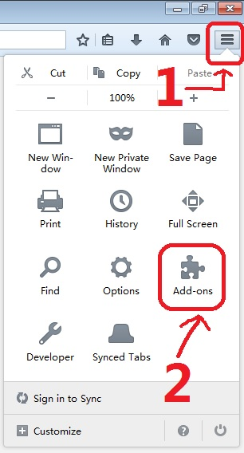
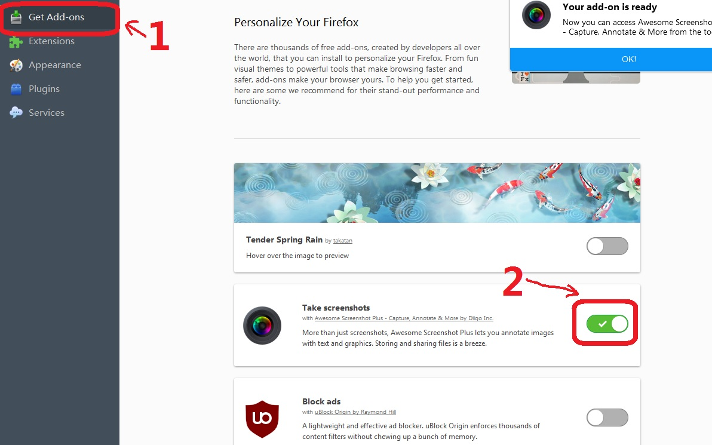
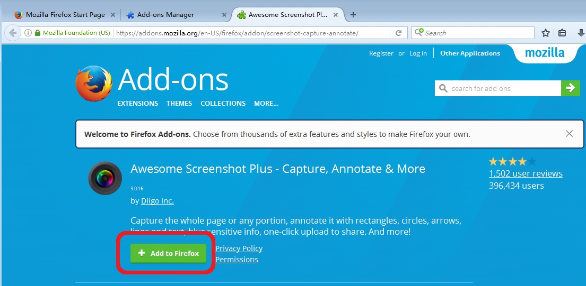
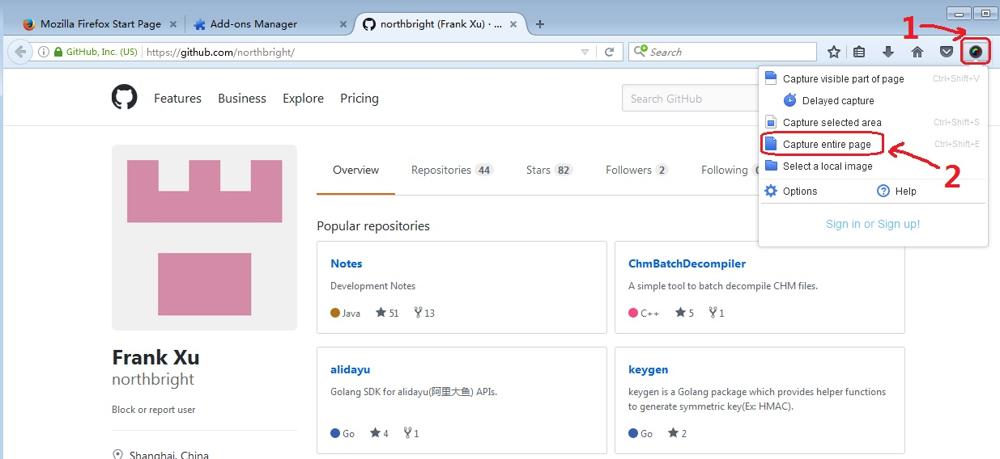
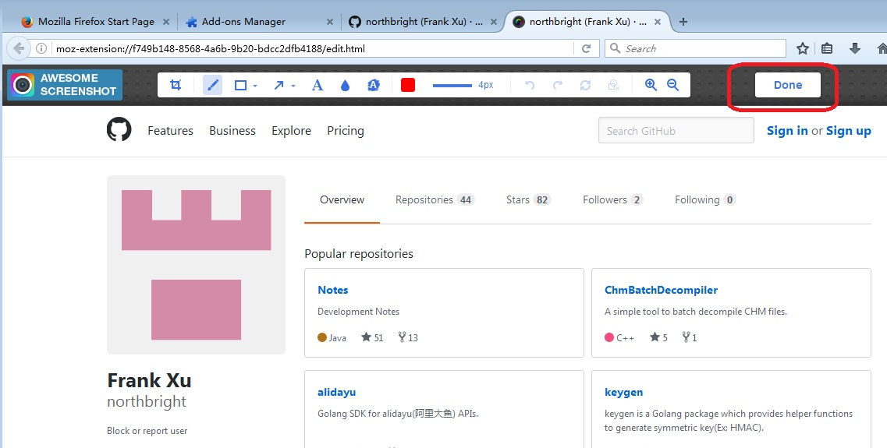
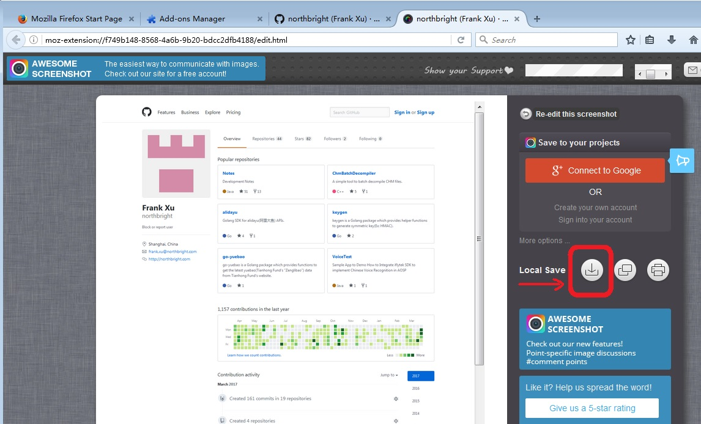

# Use Firefox Awesome Screenshot Plus Add-on to Capture Entire Web Page as Image

#### Steps

1. Download [Firefox](https://www.mozilla.org/zh-CN/firefox/new/).

2. Install "Awesome Screenshot Plus" Add-on.

    * Open Menu and Click "Add-ons".

    

    * Click "Get Add-ons" and Find & Install "Take screenshots with Awesome Screenshot Plus" Add-on.

    

    * If you can not find it, go to <https://addons.mozilla.org/zh-CN/firefox/addon/screenshot-capture-annotate/> to install it.

        

3. Open Your Page in Firefox.

4. Click "Awesome Sreenshot Plus" Icon and Select "Capture entire page".

    

5. Click "Done" Button.

    

6. Click "Local Save" Button.

    

