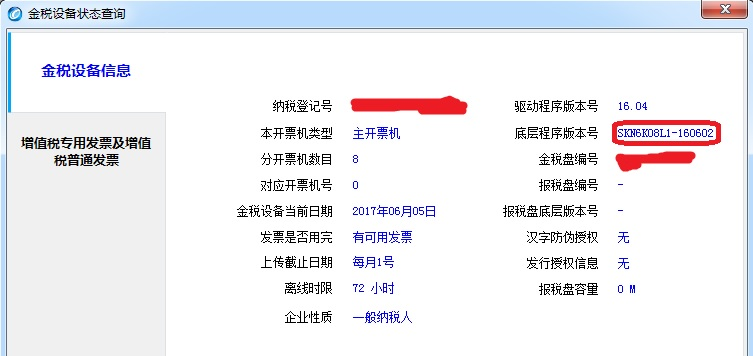
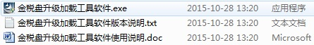
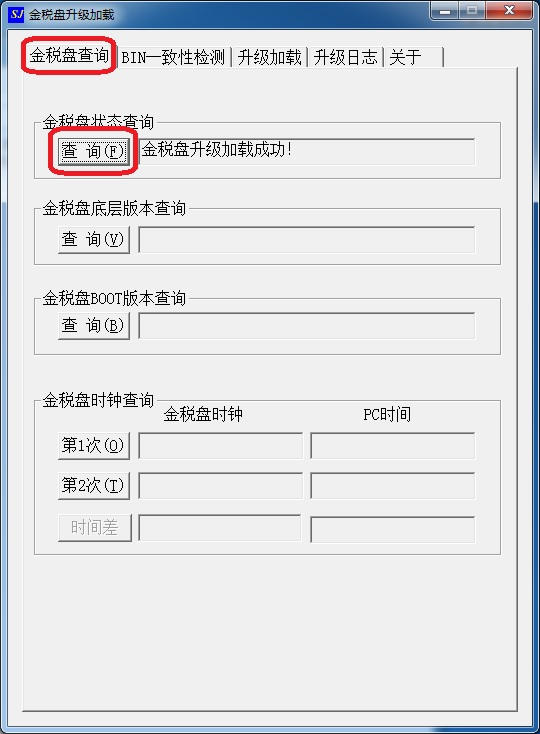

# 升级金税盘底层固件的方法

#### 查看金税盘底层固件版本
1. 插入金税盘，打开“开票软件”。
2. 点击“报税处理”->"状态查询"->查看"底层程序版本号"
3. "-XXXXXX"结尾的就是“年月日”的版本号（比如:160602)。

    
    

#### 安装金税盘底层升级程序
1. 确认安装包以及升级固件(.bin)所在位置

    
    

2. 双击运行安装程序进行安装

#### 升级金税盘底层固件
1. 如果“开票软件”已经打开，关闭退出。
2. 运行安装好的“金税盘升级加载工具软件”

    
3. 选择“金税盘状态查询”分页，点击“查询”。如果第一次出现错误，再点击一次即可成功。

   

4. 点击“升级加载”分页 ，点击“指定加载文件”->选择之前的bin文件。点击“读取金税盘”，“升级加载”。

    
    

