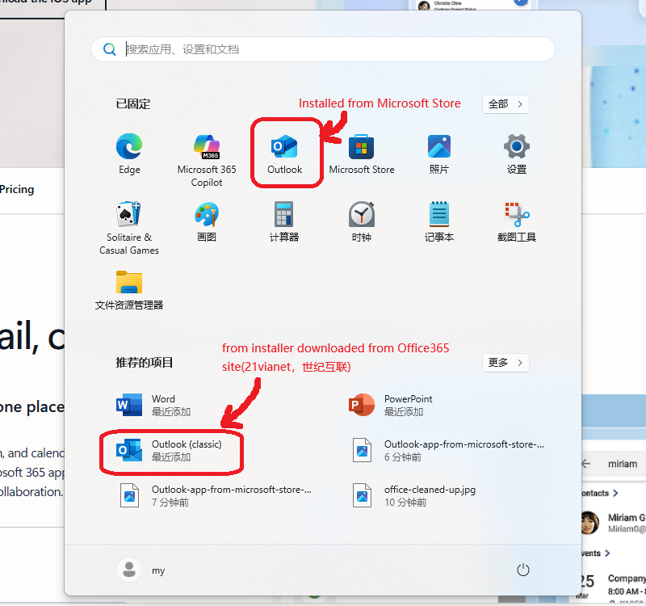

# Got "AADSTS90044 national cloud request process switched off" Error when Run Outlook and Login Account of Office365 Operated by 21Vianet

## Problem
* Windows 11 24H2(clean install)
* Login an account of Office 365 operated by 21Vianet on <https://login.partner.microsoftonline.cn/>
* Click "Install Microsoft Office365 App" and download the installer
* Run the installer to install Office 365 app on PC
* Lanch Excel and login the account successfully
* Click Windows button > Outlook Icon
* Failed to login the account and got error:

  > "AADSTS90044 national cloud request process switched off"

## Root Cause
* It'll install "Outlook" App from Microsoft Store **automacically** after Win11 installed
* The Outlook app from Microsoft Store does NOT support the account of Microsoft 365 operated by 21 Vianet

## Solution
Use Outlook(classic) instead.

## References
* [Cannot login to Outlook for Windows (new) with Microsoft 365 (21 vianet)](https://techcommunity.microsoft.com/discussions/outlookgeneral/cannot-login-to-outlook-for-windows-new-with-microsoft-365-21-vianet/4099328)

--------------------

# 运行 Outlook 登录世纪互联运营的 Office 365 账号报错: "AADSTS90044 national cloud request process switched off"

## 问题
* Windows 11 24H2(干净安装)
* 访问 <https://login.partner.microsoftonline.cn/> 然后登录世纪互联运营的 Office 365 账号
* 点击"安装"下载安装器
* 运行安装器在电脑上安装 Office 365 本地 App
* 运行 Excel 然后成功登录世纪互联运营的 Office 365 账号
* 点击 Windows 按钮 > Outlook 图标
* 登录世纪互联运营的 Office 365 账号报错: "AADSTS90044 national cloud request process switched off"

## 原因
* Win11 安装后，系统自动从 Microsoft Store（商店）安装 Outlook App
* 来自 Microsoft Store（商店）的 Outlook App 不支持世纪互联运营的 Office 365 账号

## 解决方法
使用本地安装的 Outlook(classic)。

## 参考资料
* [Cannot login to Outlook for Windows (new) with Microsoft 365 (21 vianet)](https://techcommunity.microsoft.com/discussions/outlookgeneral/cannot-login-to-outlook-for-windows-new-with-microsoft-365-21-vianet/4099328)
