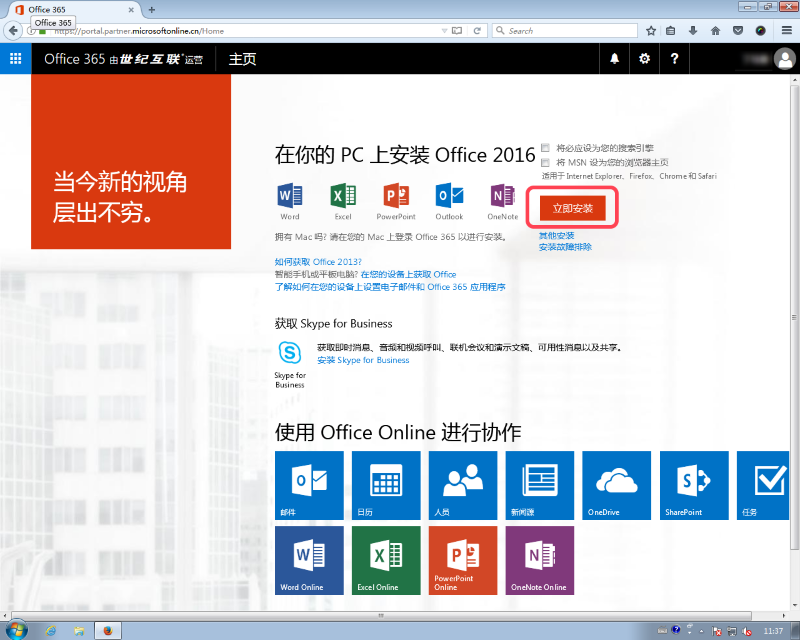
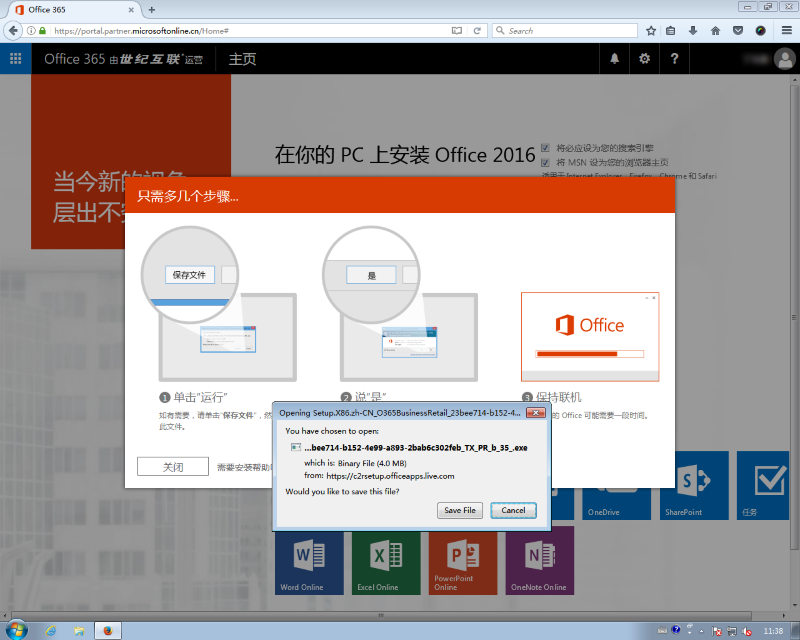
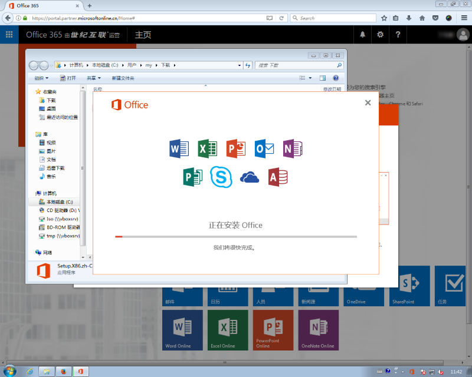
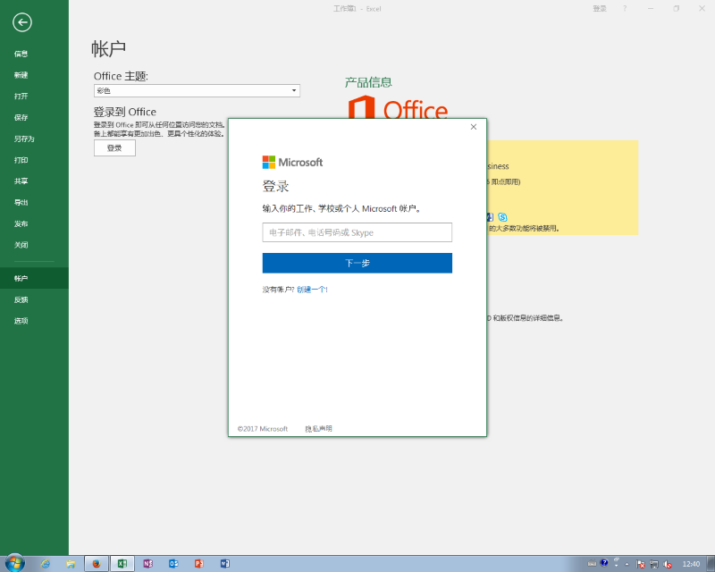
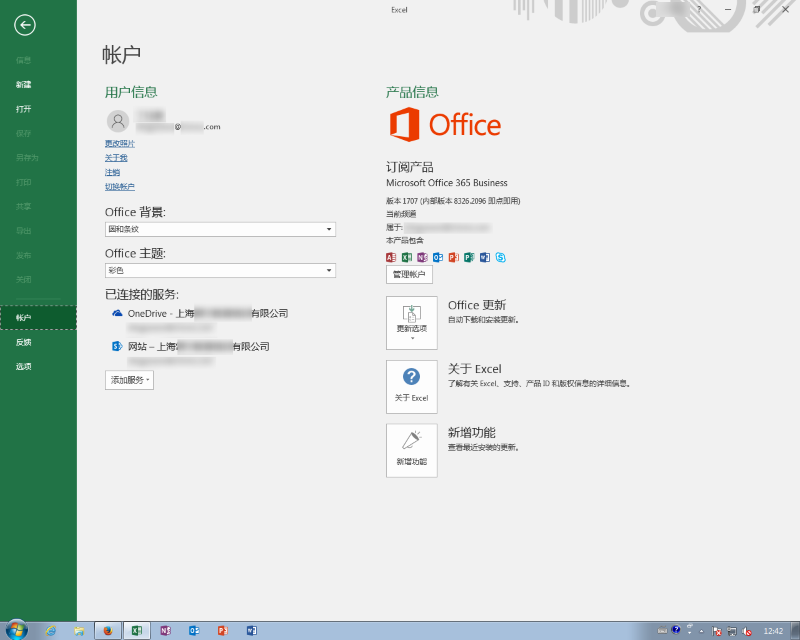

# 安装世纪互联Office 365订阅的Office应用

### Part I. 安装Office应用
-------------------
* 打开[世纪互联Office 365官网(https://login.partner.microsoftonline.cn)](https://login.partner.microsoftonline.cn/login.srf)
* 使用自己的Office 365账号，密码登录。
* 下载Office安装程序。
   登陆后，在首页右上方点击`安装`按钮。
    
   

* 运行下载好的安装程序，联网安装Office。

  
  

### Part II. 配置并激活Office
-------------------
* 运行任意一个Office程序，比如Excel。
* 打开一个文件，在左侧边栏选择`账户`。

  
* 输入Office 365账号，密码，激活Office。

  

