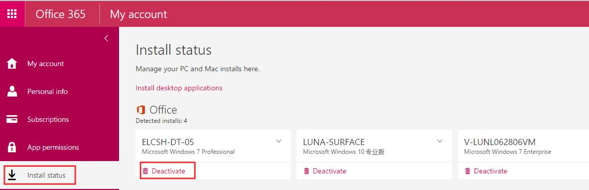
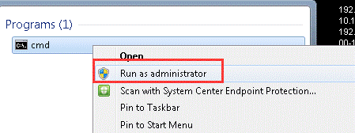
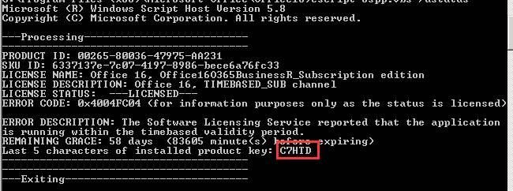
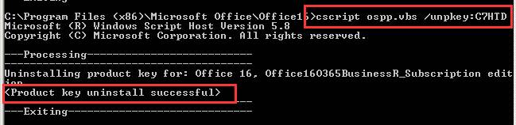
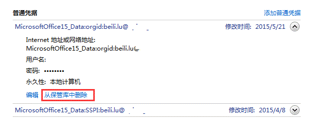

# Reactivate Office Installed on PC to Fix Office 365 Subscription Problem

#### Background
* We purchased Office 365 Bussiness Premium Licenses.
* Office 2016 has been installed on a PC and login with an account which assigned Office 365 license and works fine.

#### Problem
* It prompted a window with "Your Office 365 subscription has problem, we need your help to fix" message and a "Reactivate" button.

#### Solution

MSFT said that we need to clear the activation information stored on PC and reactivate Office.

#### Steps
1. Sign out account for the office on PC
    * Open a Office app(Excel or Word...)
    * Click "Sign out"

        

2. Goto Office 365 Portal and Deactivate the Office Install on the PC.
    * Goto "Settings" -> "Install status"
    * Select the PC which has installed Office and click "Deactivate".

        
        

3. Close all Office apps.

4. Find the path of Office.
    * Office 2016 32bit
        `C:\Program Files(x86)\Microsoft Office\Office16`

5. Run a `cmd` as administrator

    * Type `cd C:\Program Files(x86)\Microsoft Office\Office16`

    

6. View Office Product Key.

    * Type `cscript ospp.vbs /dstatus` to find the last 5 characters of product key.
    * Ex: in this example, it's C7HTD

    

7. Remove Office Product Key.

    * Type `cscript ospp.vbs /unpkey: C7HTD`

    

8. Goto "Control Panel" to remove stored credentials referenceing the Office 365.

    * Goto "Control Panel" -> "User Accounts" -> "Credential Manager"
    * In the "Windows Credentials and Generic Credentials" section, remove andy stored credentials referencing the Office 365 account(has MicrosoftOffice prefix).
        * Click "Details".
        * Click "Remove from vault".

        

 9. Open a Office app(Excel or word...) and reactivate with Office 365 account.

