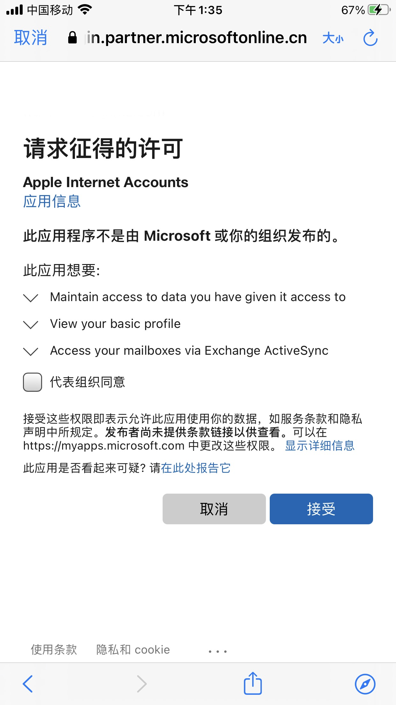
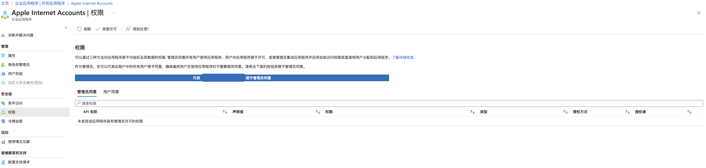

# Setup Email Account on iOS for Office 365 Operated by 21Vianet

## Update
* 21Vianet Disabled Basic AUTH and Force Users to Use Modern Auth for Exchange Since May 2023
* iOS Native Mail App Does NOT Work(popup incorrect password or can not validate account error message) for Existing Accouts which Use Basic Auth
* iOS Native Mail App Supports Mordern Auth Since iOS 11(for Office 365 Global Only but NOT for Office 365 operated by 21Vianet)
* On 2023/05/18, 21Vianet's Support Engineer Emailed Me that iOS Native Mail App Can Work with Office 365 Operated by 21Vianet Using Modern Auth

## Steps for Modern Auth(OAuth 2.0)
* Goto "Settings" > "Apps" > "Mail" > "Account" > "New Account"
* Select "Exchange"
  Update: on iOS 18.6, a Security Delay(1 hour) is required before adding an Exchange account.
  You may [Turn Off Security Delay on iOS](https://github.com/northbright/Notes/blob/master/ios/turn-off-security-delay-on-ios.md).

* Input Email Account and Description > Click "Login"
* It'll Popup a Dialog to Accecpt the Permission for "Apple Internet Accounts"
* Click "Accept"

  

  * If your account is administrator, you may check "Grant Admin Consent" option to make other tenants skip this step
  * If you forget to check the option, you can go to the Office 365 Web Portal to this
    * Azure Active Directory admin center > Enterprise Applications > All applications > Apple Internet Accounts
    * Select "Permission" on the side bar
    * Click "Grant admin consent for XXX(XXX is your orgnization)

  

## Steps for Basic Auth(obsoleted and NOT work any more)
* ~~Goto "Settings" > "Mail" > "Account" > "New Account"~~
* ~~Select "Exchange"~~
* ~~Input Email and click "Next"~~
* ~~Select "Manual Configuration" on the popup window and input password~~
* ~~Exchange Server: `partner.outlook.cn`~~
* ~~Other settings in "Manual Configuration"~~
  * ~~Domain(Optional): **NO** need to set~~
  * ~~Username: Email~~
  * ~~Password: password for the email account~~

## References
* [Microsoft and Apple Working Together to Improve Exchange Online Security](https://techcommunity.microsoft.com/t5/exchange-team-blog/microsoft-and-apple-working-together-to-improve-exchange-online/ba-p/3513846)
* [将 Apple 设备与 Microsoft Exchange 集成](https://support.apple.com/zh-cn/guide/deployment/dep158966b23/web)
* [Turn Off Security Delay on iOS](https://github.com/northbright/Notes/blob/master/ios/turn-off-security-delay-on-ios.md)

-----------------------------------------------

# 在iOS上设置由世纪互联运营的Office 365帐号

## 更新
* 从 2023 年 5 月开始，世界互联运营的 Office 365 禁用了 Basic Auth 同时强制用户使用 Modern Auth
* 对于已经存在的使用 Basic Auth 的账户，iOS 原生邮件 App 不能正常工作（弹出错误的密码或者不能验证账户的错误） 
* 从 iOS 11 开始，原生邮件 App 已经可以支持 Modern Auth（只支持 Office 365 全球版不支持世纪互联运营的 Office 365）
* 2023 年 5 月 18 日，世纪互联的支持工程师发邮件给我通知世纪互联运营的 Office 365 也支持 iOS 原生邮件 App 使用 Modern Auth 了

## 使用 Modern Auth(OAuth 2.0) 的步骤
* 进入 "设置" > "邮件" > "账户" > "添加账户"
* 选择 "Exchange" 类型
  Update: iOS 18.6 会提示 1 小时安全延迟，结束收到通知后才能添加账户。
  你可以[Turn Off Security Delay on iOS](https://github.com/northbright/Notes/blob/master/ios/turn-off-security-delay-on-ios.md)。

* 输入 Email 后点击"登录"
* 会弹出"Apple Internet Accounts"的授权请求的页面

  

  * 如果当前账户是管理员，你可以勾选“代表组织同意”。这样后续其他成员可以跳过这一步
  * 如果忘记勾选，可以在 Office 365 的管理页面来代理授权
    * Azure Active Directory admin center > 企业应用程序 > 所有应用程序 > Apple Internet Accounts
    * 选择左侧的“权限”
    * 点击“代表 XXX（你的组织）授权管理员同意” 

  

## 使用 Basic Auth 的步骤（已经废弃而且已经不能正常工作）
* ~~进入 "设置" > "邮件" > "账户" > "添加账户"~~
* ~~选择 "Exchange" 类型~~
* ~~输入Email后点击"下一步"~~
* ~~在弹出的窗口中选择"手动配置"，输入密码~~
* ~~Exchange Server(服务器)输入: `partner.outlook.cn`~~
* ~~其他“手动配置”的设置~~
  * ~~域：留空即可~~
  * ~~用户名：Email地址~~
  * ~~密码：对应的密码~~

## 参考资料
* [Microsoft and Apple Working Together to Improve Exchange Online Security](https://techcommunity.microsoft.com/t5/exchange-team-blog/microsoft-and-apple-working-together-to-improve-exchange-online/ba-p/3513846)
* [将 Apple 设备与 Microsoft Exchange 集成](https://support.apple.com/zh-cn/guide/deployment/dep158966b23/web)
* [Turn Off Security Delay on iOS](https://github.com/northbright/Notes/blob/master/ios/turn-off-security-delay-on-ios.md)
