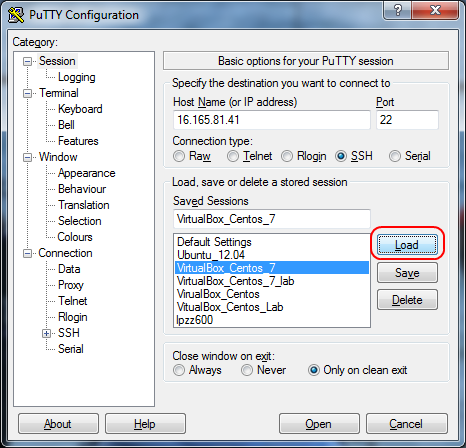
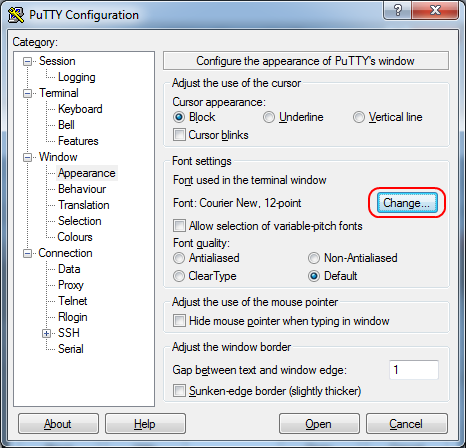
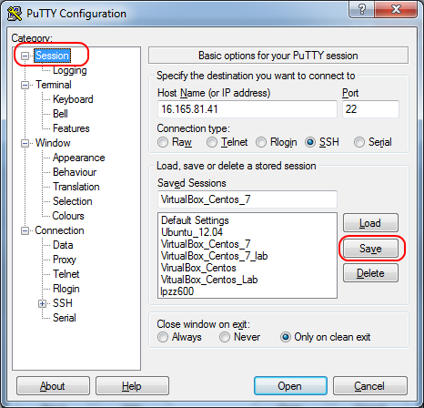

# Set Font in Putty Permanently

1. Load a Saved Session  
   

2. Change Font Settings for Current Session  
   Click "Window" -> "Appearance" -> "Font Settings" -> "Change" to change font settings.
   

3. Switch Back to "Session" and Save Current Session  
   Click "Session" again to switch back to session config and save current session.
   