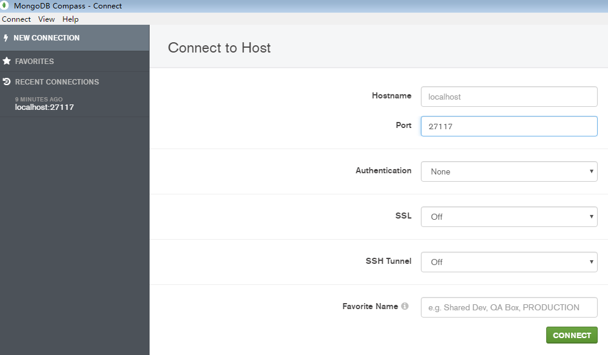
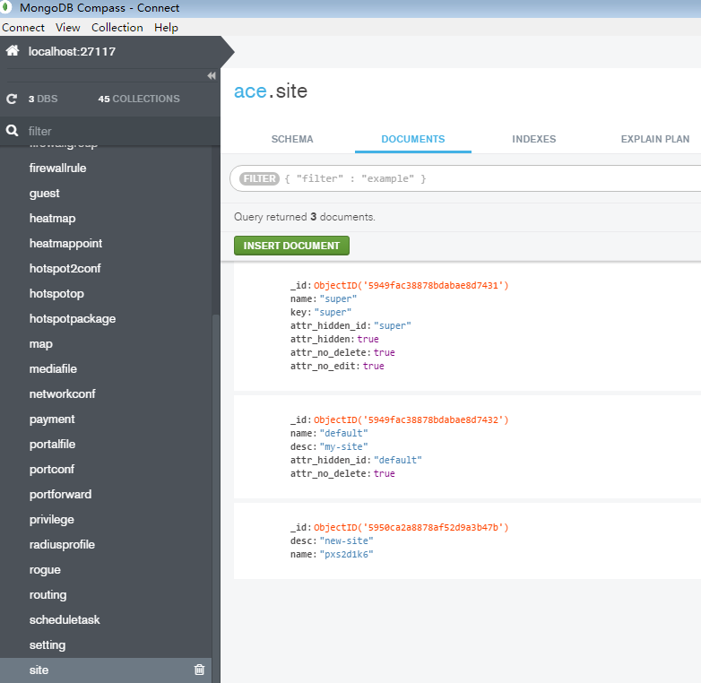

# Use Compass to Explore mongoDB of Unifi

#### Problem
* Need to know the names of sites created in Unifi

#### Solution
* Download and run [Compass](https://www.mongodb.com/products/compass)
* Set `Port` to `27117`.
    * The MongoDB instance started by the UniFi Controller runs on 27117

    

* Click "Connect".
* Select "ace" db -> "site" on the left side bar.
* Select "DOCUMENTS" tab to explore all sites.
    * `name` is the real name can used by Unifi APIs.
    * `desc` is the description of site that is the "site name" can be set in Unifi GUI.

    

#### References
* [UniFi controller data ports and Mongod ports ?](https://community.ubnt.com/t5/UniFi-Wireless/UniFi-controller-data-ports-and-Mongod-ports/td-p/1109887)
