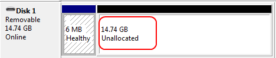

# Clean the USB Disk Created by Win32DiskImager

* After written linux iso to USB Disk via Win32DiskImager, you can see the there're:
  *  only a little available free space(~6MB) on the EFI partition
  *  unallocated space after EFI partition  
     

* How to Clean the USB Disk after installation  
  Run `cmd` to open a shell

  * `diskpart`
  * list disk via `list disk`  
    You will see the ID of your USB disk
  * select USB disk via `select disk <USB Disk ID>`
  * `clean`
  * `create partition primary`
  * `format quick`
  * `exit`