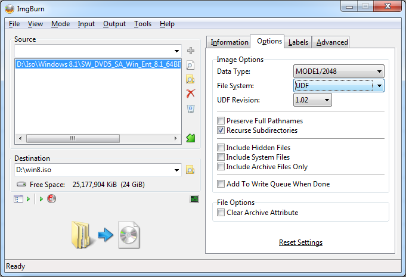
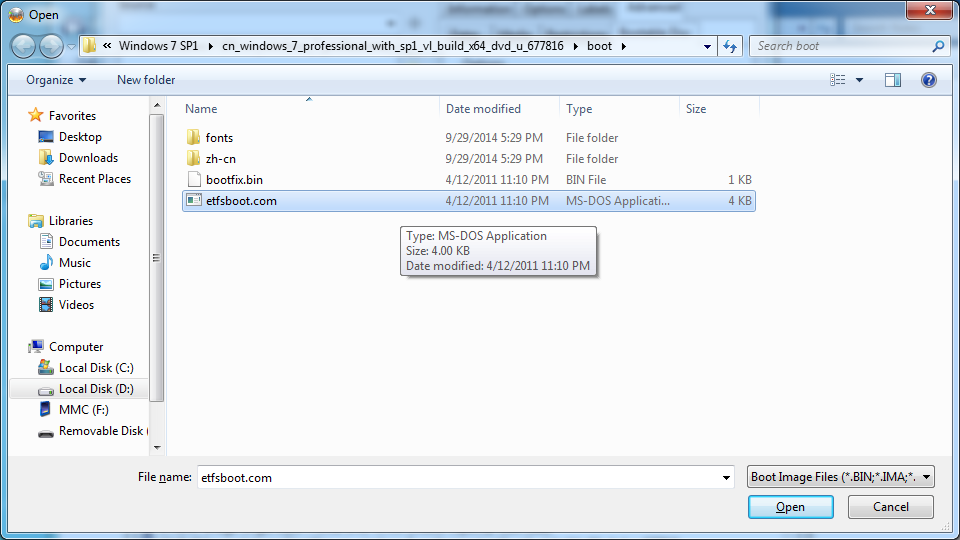

# Create Windows 7 ISO File from Extracted Folder via ImgBurn

* Select your Windows folder(extracted from a Windows ISO file).

* Set "Options" -> "File System" to "UDF"  

* Switch to "Advanced" -> "Bootable Disc"

    * Select "Boot Image" in your Windows folder: `boot\etfsboot.com`
    * Keep "Load Segment" as default value(`07c0`)
    * Set "Sectors to Load" to `8`

* Click "Build" button
* For more information, see:  

    <http://forum.imgburn.com/index.php?/topic/11194-how-to-create-a-windows-vista-7-8-installation-disc-bootable-using-imgburn/>

