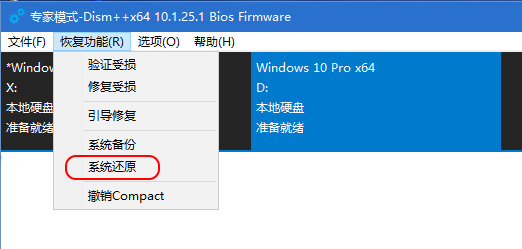
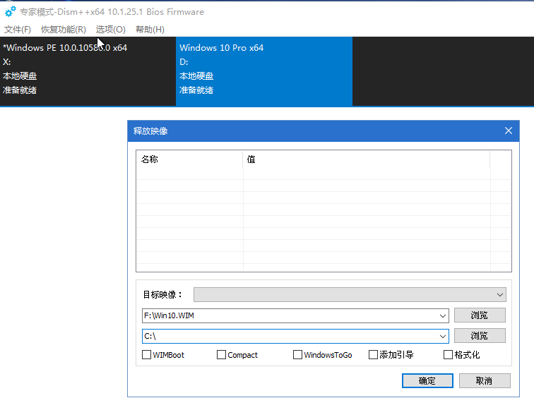

# Restore `WIM` to Install Windows 10 on a New SSD using GPT

## Problem
* Have an HP PC with Windows 10 Home pre-installed
* Did some customizations and created a WIM file using [Dism++](https://www.chuyu.me)
* Purchased a new SSD
* Want to restore Windows 10 using GPT on the SSD for the same PC

## Steps
* [Install WinPE on a USB Disk with UEFI Support](../install-winpe-on-a-usb-disk-with-uefi-boot-support/install-winpe-on-a-usb-disk-with-uefi-boot-support.md)
* Copy the WIM file to the USB disk
* Reboot PC from USB disk(UEFI mode)
* WinPE has been launched
* Run [Diskpart](https://docs.microsoft.com/en-us/windows-hardware/manufacture/desktop/configure-uefigpt-based-hard-drive-partitions) tool to initialize the SSD

  ```
  // Run cmd and launch diskpart
  diskpart
  
  // Select the disk X(X is the ID of SSD)
  select disk X
  
  // Check if SSD is selected(has a * )
  list disk

  // Clean the SSD
  clean

  // Convert SSD to GPT
  convert gpt

  // Create EFI(ESP) Partition
  create partition efi size=360

  // Format EFI Partition
  format quick fs=fat32 label="System"

  // Create MSR Partition
  create partition msr size=128

  // Create Windows Partition(use all left capacity)
  create partition primary

  // Shrink Windows Partition to Create Partition for Recovery Tools
  shrink minimum=500
  
  // Format Windows Partition
  format quick fs=ntfs label="Windows"

  // Create Recovery Tools Partition
  create partition primary

  // Format Recovery Tools Partition
  format quick fs=ntfs label="Recovery tools"

  // Clean the Hard Disk if need(optional)
  // !!!! Backup data before clean !!!!!
  // Y is the ID of Hard Disk
  select disk Y
  clean
  create partition primary
  format quick fs=ntfs label="Data"

  // Exit
  exit

  ```

* Assign Drive Letters
  * `C` for `Windows` on SSD
  * `D` for `Data` on Hard Disk

* Run "Dism++" icon to run [`Dism++`](https://www.chuyu.me)
   * Select the Windows 10 on local disk / drive(e.g. `C:\`)
   * Goto "Menu" -> "Recovery Tools(恢复功能)" -> "System Recovery(系统还原)"
      * Select the Win10 image on the USB disk(e.g. `F:\Win10.wim`)
      * Select the local drive path to extract the Win10 image(e.g. `C:\`)
      * Click "OK" to restore Win10 image

         
         

   * After WIM restored successfully, Goto "Menu" -> "Recovery Tools(恢复功能)" -> "Boot Recovery(引导修复)"

* Remove USB disk and reboot PC
