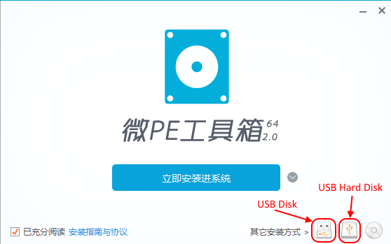
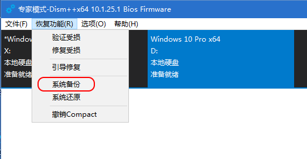
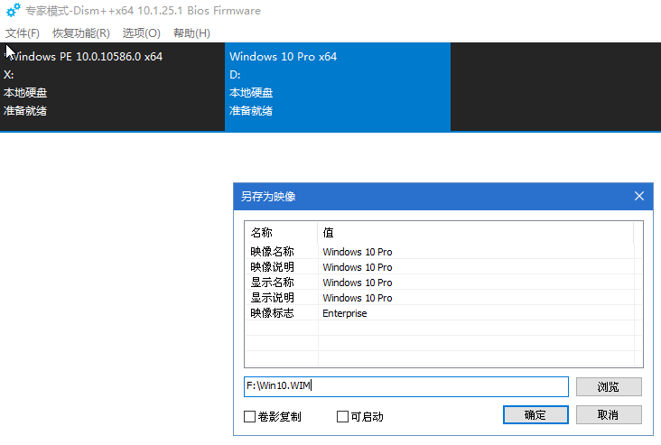

# Use [WePE](http://www.wepe.com.cn/) and [Dism++](http://www.chuyu.me/zh-Hans/index.html) to Deploy Customized Win10 Image on HP PCs

## Problem
* We purchased 10+  HP PCs for employees
* OS: Win10 Home pre-installed by HP
* Need some customizations on Win10
   * Pre-install some apps
   * Connect shared folders / printers on local network
   * UI / settings customizations
   * Windows Updates
* Want to do once and deploy the customized Win10 image to all PCs to save time
* Win10 on all PCs should keep activated

## Steps
* Select one PC and do all the `customizations`
* Plug in an empty USB Disk
   * It'll install [WePE](http://www.wepe.com.cn/)  and store Win10 image on the USB disk
   * 64GB or larger is recommended
*  Run [WePE](http://www.wepe.com.cn/)  on the **selected** PC
   * Install WePE on USB disk with `Legacy/UEFI boot` support

     
     
   
* Boot PC from USB Disk(`UEFI`)
* After Win10 PE loaded, click "Dism++" icon to run `Dism++`
   * Select the Windows 10 on local disk / drive(e.g. `C:\`) 
   * Goto "Menu" -> "System Restore" -> "System Backup"
      * Input the path of Win10 image to store on the USB disk(e.g. `F:\Win10.WIM`)
      * Click "OK" and the Win10 image will be generated to the USB disk

         
         

* Power off the PC and remove the USB disk
* Boot **rest** PCs from USB Disk(`UEFI`)
* After Win10 PE loaded, click "Dism++" icon to run `Dism++`
   * Select the Windows 10 on local disk / drive(e.g. `C:\`) 
   * Goto "Menu" -> "System Restore" -> "System Restore"
      * Select the Win10 image on the USB disk(e.g. `F:\Win10.wim`)
      * Select the local drive path to extract the Win10 image(e.g. `C:\`)
      * Click "OK" to restore Win10 image

         
         
* Remove the USB disk and reboot PC
* Rename PC name to another one and check Windows activation status
