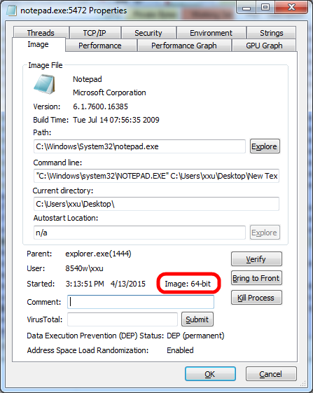

# How to Check if A Binary Is x86 or x64

There're 2 useful tools from [sysinternals](https://technet.microsoft.com/en-us/sysinternals/default):

* [SigCheck](https://technet.microsoft.com/en-us/sysinternals/bb897441.aspx)

        sigcheck c:\windows\notepad.exe

        Copyright (C) 2004-2015 Mark Russinovich
        Sysinternals - www.sysinternals.com

        c:\windows\notepad.exe:
            Verified:       Signed
            Signing date:   11:17 AM 7/14/2009
            Publisher:      Microsoft Windows
            Description:    Notepad
            Product:        Microsoft?Windows?Operating System
            Prod version:   6.1.7600.16385
            File version:   6.1.7600.16385 (win7_rtm.090713-1255)
            MachineType:    64-bit

* [Process Explorer](https://technet.microsoft.com/en-us/sysinternals/bb896653)

#### References

* <http://superuser.com/questions/358434/how-to-check-if-a-binary-is-32-or-64-bit-on-windows>
