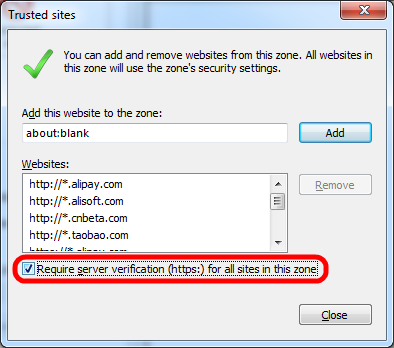

# Uncheck Require Server Verification(https) for All Sites in This Zone

#### How to

* Find `[HKCU\SOFTWARE\Microsoft\Windows\CurrentVersion\Internet Settings\Zones\2\]`
* To uncheck, set `Flags` to `67`(0x43)
* To check again, set `Flags` to `71`(0x47)

#### Example

* [Registry File](./files/uncheck_require_server_verification.reg)

        [HKEY_LOCAL_MACHINE\Software\Microsoft\Active Setup\Installed Components\UncheckRequireServerVerification]
        "Version"="1,0"

        [HKEY_LOCAL_MACHINE\Software\Microsoft\Active Setup\Installed Components\UncheckRequireServerVerification]
        "StubPath"="reg add \"HKEY_CURRENT_USER\\Software\\Microsoft\\Windows\\CurrentVersion\\Internet Settings\\Zones\\2\" /v Flags /d 67 /t REG_DWORD /f"

* How to Use
  * Run the [Registry File](./files/uncheck_require_server_verification.reg)
  * Log out and log in again(or restart)
  * Work for all users

#### References
* [Group policy to check/uncheck “require HTTPS” in Internet Explorer 11 trusted sites list?](http://serverfault.com/questions/594668/group-policy-to-check-uncheck-require-https-in-internet-explorer-11-trusted-si)
* [Require Server Verification (https:) for all sites in this zone](http://answers.microsoft.com/en-us/ie/forum/ie9-windows_7/require-server-verification-https-for-all-sites-in/d9691dc6-998d-45e1-b16c-c1039ab195bb?auth=1)
* [Add Trusted Sites for Current User and All Users on Windows 7 and Later](https://github.com/northbright/Notes/blob/master/Windows/trusted_sites/add_trusted_sites_for_all_users_on_windows_7_and_later/add_trusted_sites_for_current_user_and_all_users_on_windows_7_and_later.md)