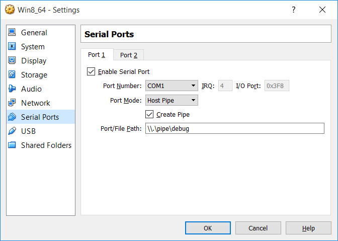
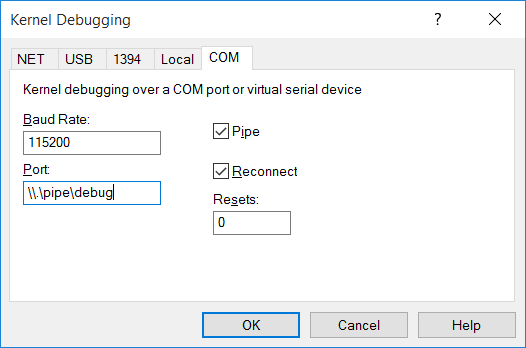

# Debug Windows in Virtual Box

#### Virtual Box Settings
* Install Windows(8, 8.1, 10...) in Virtual Box
* Create a pipe to connect host and guest via serial port

    * `Settings` -> `Serial Ports` -> `Enable Serial Port`
    * Port Number: `COM1`
    * Port Mode: `Host Pipe`
    * Check `Create Pipe`
    * Port/File Path: `\\.\pipe\XX`
      * XX can be your pipe name
      * e.g. `\\.\pipe\debug`

    

#### Configure Debug Settings in guest Windows
Run follow commands as **administrator**:  

* Enable Debug Mode
  * `bcdedit /debug on`

* Enable Test Signing(for debugging x64 drivers)
  * `bcdedit -set testsigning on`

* Enable Boot Debug(for the drivers that will be loaded at the very early boot stage)
  * `bcdedit -set bootdebug on`

* Configure Debug Settings
  * `bcdedit /dbgsettings SERIAL DEBUGPORT:1 BAUDRATE:115200`

* Check Settings
  * `bcdedit`

#### Debug via WinDbg
* Debug via WinDbg

    * `File` -> `Kernel Debug`
      * COM
        * Buad Rate: `115200`
        * Port: `\\.\pipe\debug`
        * Check `Pipe`
        * Check `Reconnect`

    

* Click "break" to break guest Windows
* Run `g` to resume guest Windows

#### References
* [Setting Up Kernel-Mode Debugging of a Virtual Machine in Visual Studio](https://msdn.microsoft.com/en-us/library/windows/hardware/jj200334(v=vs.85).aspx)