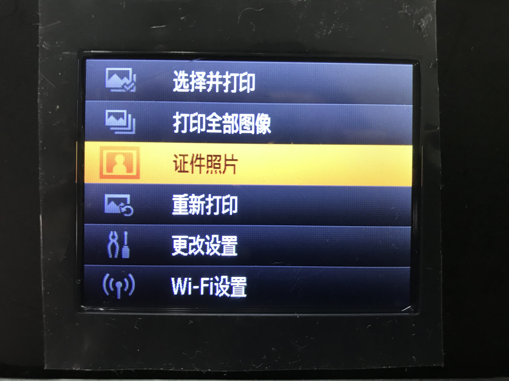
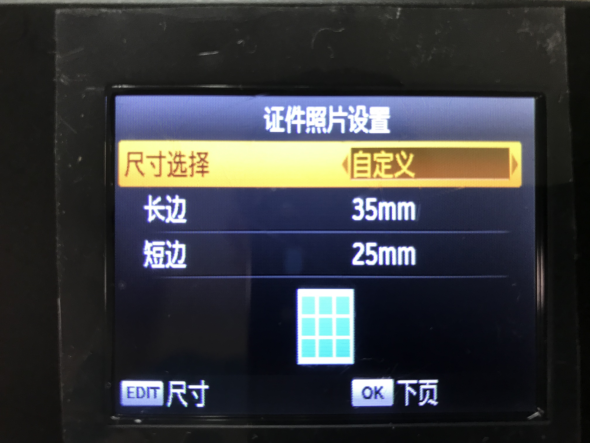

# Print 1 Inch ID Photo Using Canon SELPHY CP1200

## Solution
* Place 4R(6" inch) photo paper into the paper box(5" inch card paper can **NOT** be used)
* Plug USB disk or SD card which contains ID photo to CP1200 and power on
* Press "Menu" button and select "ID Photo"

  

* Select "Custom" for Size Selection
* Set "Long Side" to 35mm and "Short Side" to 25mm for 1" inch ID photo

  

* Press "OK" button to preview the photo(it will print 9 1" inch photos on 1 4R paper
* Press "Print" button to start printing

## References
* [Printing ID Photos (SELPHY CP1200)](https://www.canon.co.uk/support/consumer_products/content/faq/?itemid=tcm:14-1340745)
* [如何用佳能cp1200打印一寸照片（只有六寸的相纸）？](https://www.zhihu.com/question/53513235)

------------

# 使用佳能 SELPHY CP1200 打印机打印 1 英寸证件照

## 方法
* 将 4R（6 英寸）相纸放入纸盒（不能使用 5 英寸卡片）
* 将存有证件照的 U 盘或者 SD 卡插入 CP1200，然后开机
* 按下“Menu”按钮选择“证件照”

  

* “尺寸”选择“自定义”
* “长边”设置为 35mm，“短边”设置为 25mm，符合 1 英寸证件照的大小

  

* 按下 “OK” 按钮进行预览（1 张 4R 6 英寸相纸可以打印 9 张 1 英寸证件照）
* 按下 “Print” 按钮开始打印

## 参考资料
* [Printing ID Photos (SELPHY CP1200)](https://www.canon.co.uk/support/consumer_products/content/faq/?itemid=tcm:14-1340745)
* [如何用佳能cp1200打印一寸照片（只有六寸的相纸）？](https://www.zhihu.com/question/53513235)
