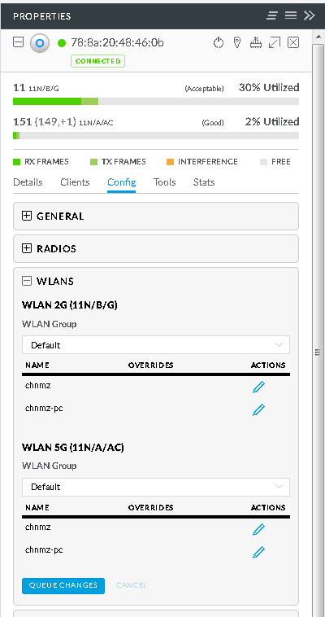

# Force UBNT UAP to USE 2G only

## Preparation
1. Download and run [Unifi Controller(SDN)](https://www.ubnt.com.cn/download/unifi)
2. Goto "Devices" -> Select the UAP -> "Config" -> "WLANS"
3. You may see 2 WLANS:
     * WLAN 2G
     * WLAN 5G

     

## Disable 5G for all WLANs
1. Goto "WLAN Group" of 5G and select "Off"

     

## Disable 5G for Specific WLAN
1. Goto "WLAN Group" of 5G and select one (`Default` by default)
2. You may see the WLANs listed
3. Click the "Override" icon(Pencil) of specific WLAN
4. Uncheck "Enabled on this AP" option

    
