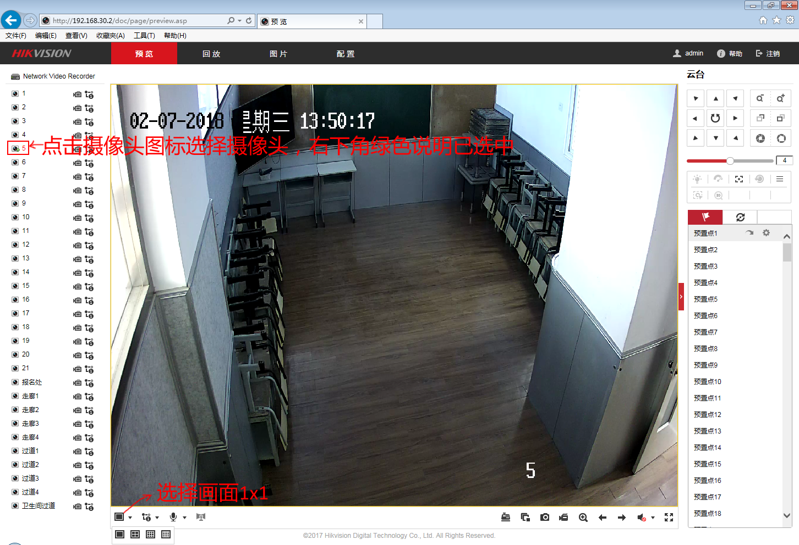
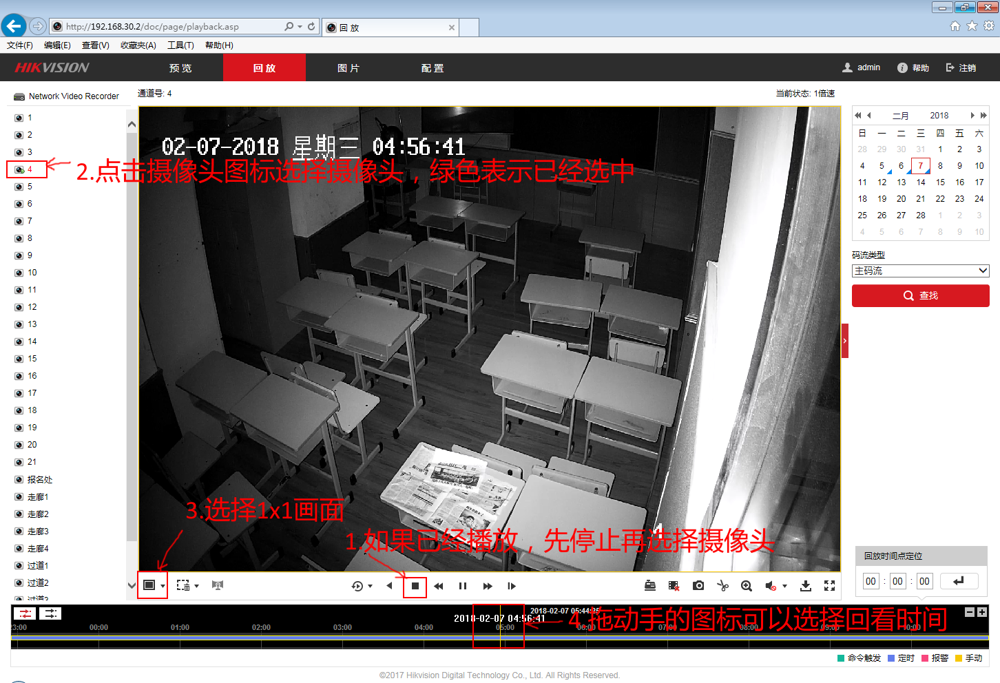

# 海康威视录像机基本操作

#### 登录
* 访问设置好的录象机的IP地址(e.g. 192.168.30.2)

#### 实时监控
* 点击"预览"选项卡
* 点击摄像头小图标，绿色说明已经选中
* 左下角可以选择画面1x1,4x4...

  

#### 回放
* 点击"回放"选项卡
* 如果已经回放，先点击"停止"按钮
* 点击摄像头小图标，绿色说明已经选中
* 左下角可以选择画面1x1,4x4...
* 点击播放按钮，左右拖动手的图标可以选择回放时间

  
