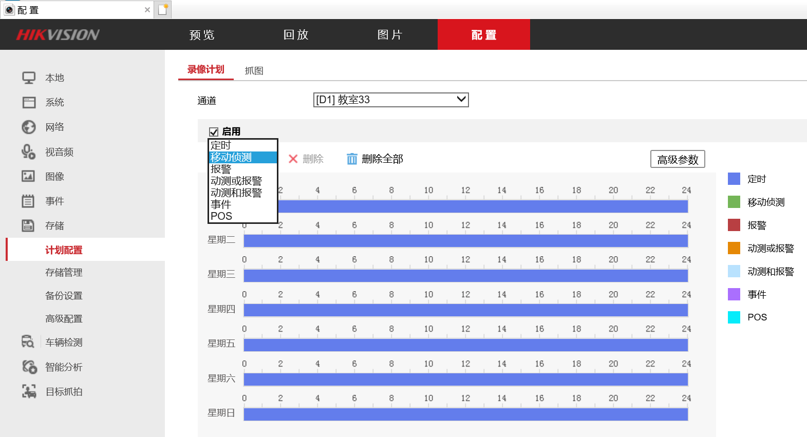
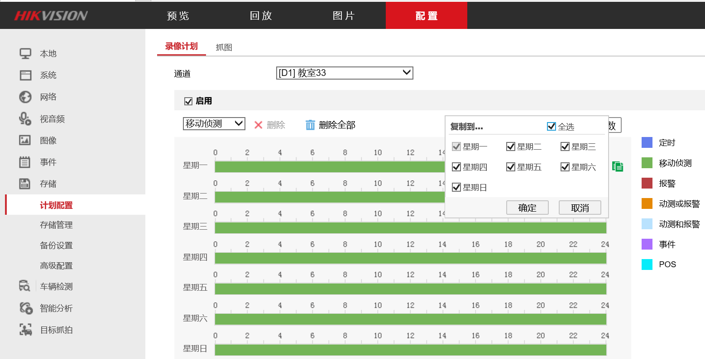
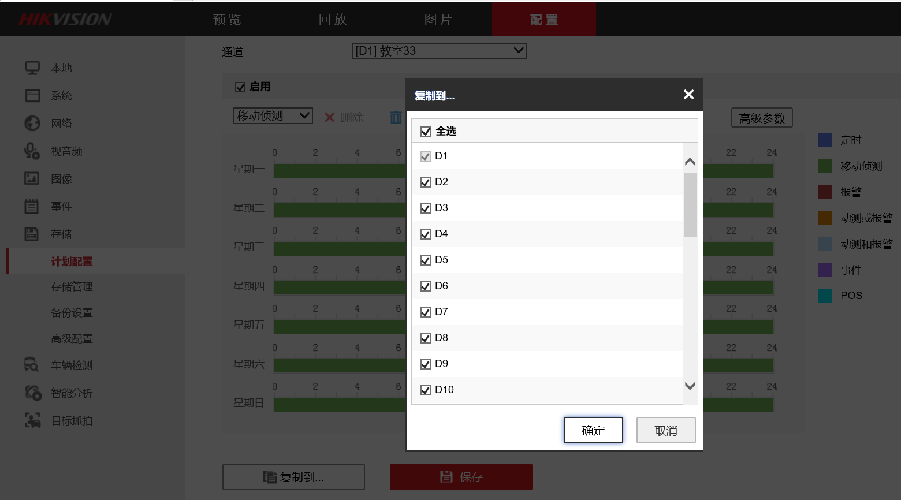

# 海康威视录像机设置移动侦测录像

## 解决方法
* 录像机管理页面->"设置"->"存储"->"计划配置"
* 在"启用"下选择"移动侦测"

  

* 点击"星期一"的长条，在弹出的窗口中选择"移动侦测"，时间选择00:00 - 24:00，保存

  

* 点击"星期一"的长条右侧的复制文件的小图标，选择"全选"复制到周一至周日

  

* 点击页面底部的"复制到..."按钮，复制到所有需要的通道，开启"移动侦测"录像

  

* 点击"保存"
