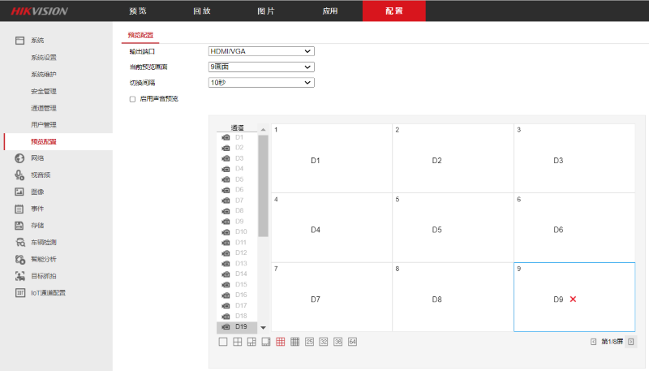

# 海康威视 DS-8664N-I16 硬盘录像机预览轮巡设置

## 方法
* 访问 NVR 的 IP，进入管理页面
* 进入配置 > 预览配置 > 选择输出端口
* 选择预览画面（e.g. 9画面)
  * 默认会将所有通道依次分配到预览屏幕中
    
    比如有 36 个通道，预览画面使用 9 画面，会有 4 个屏
* 设置切换时间（e.g. 10 秒）
* 在每一屏的画面中，点击画面中的格子(+)，然后点击左侧的通道，添加相应的通道
* 如果想删除通道，点击格子，再点击(x)，即可删除
  * 如果通道被删除，则当前屏不显示画面（黑屏 + Hikvision 的 logo）
  * 如果后续屏中删除了所有画面的通道，则该屏就不显示在轮巡中
   
    e.g. 如果 36 个通道，使用 9 画面，通道只保留前 18 个，后续 18 个通道全部在 3 - 4 屏中删除，
    则轮巡的屏只有 2 个（第 1 屏 - 第 2 屏）

  

* 回到预览，点击“轮巡”的 icon，即可开始 / 停止轮巡
