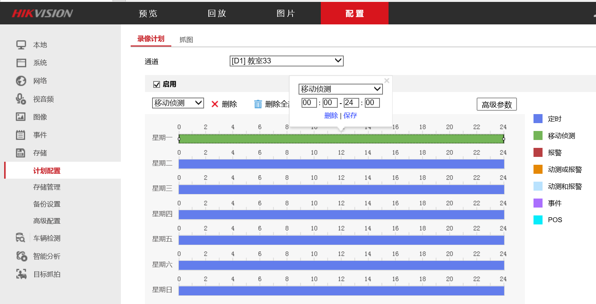
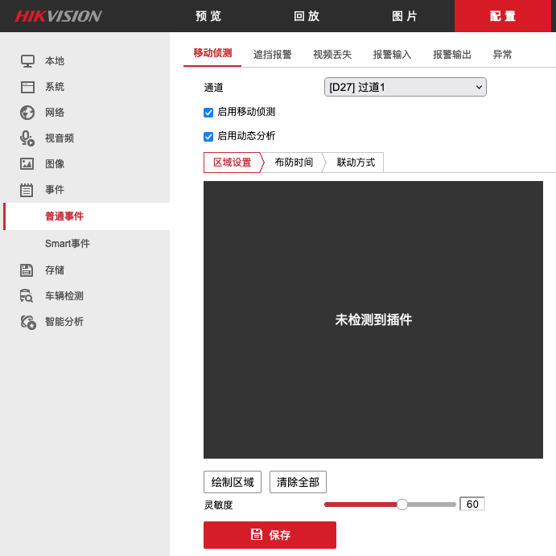

# 海康威视录像机设置移动侦测录像

## 解决方法
1. 录像机管理页面->"配置"->"存储"->"计划配置"
  * 点击"星期一"的长条，在弹出的窗口中选择"移动侦测"，时间选择00:00 - 24:00，保存

    

  * 点击"星期一"的长条右侧的复制文件的小图标，选择"全选"复制到周一至周日

    

  * 点击页面底部的"复制到..."按钮，复制到所有需要的通道，开启"移动侦测"录像

    

  * 点击"保存"

2. 事件 > 普通事件 > 选择通道 > 启动移动侦测 > 启动动态分析 > 保存

   

   如果只设置了“存储” > “计划配置”，而没有为每个通道启动移动侦测 / 动态分析，会造成不能在移动侦测的时间发生后录像，没有录像文件。
