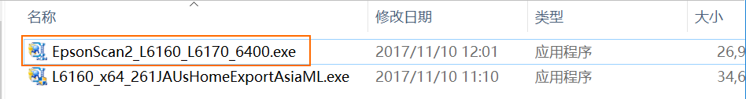

# How to Scan with EPSON L6168

## Steps
* Download EPSON L6168 drivers from [offical site](http://www.epson.com.cn/Apps/tech_support/GuideDrive.aspx?columnid=384)
* Install driver of L6168(file name: `L6160_x64_261JAUsHomeExportAsiaML.exe`)
* Install scanner utility(fle name: `EpsonScan2_L6160_L6170_6400.exe`)

   
* Run `EPSON Scan 2` and setup scanner
   * Select / Add scanner
   * Search scanner on the network and add it

   
