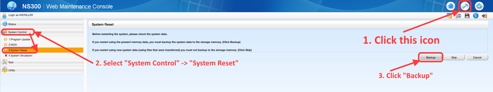

# Panasonic（松下）NS300电话程控交换机操作

## 基本操作

|  功能 | 方法 |
|  :--- | :--- |
| 分机与分机互拨 | 直接输入分机号码 |
| 拨外线电话 | 按`9` |
| 分机拨总机 | 按 `0` |
| 总机响铃后，分机代接 | 按`*#`(注意：如果出现`*#`不能转接，可以尝试`*4001`) |
| 模拟电话转接（分机默认为模拟段话）| 1. 按`转接`／`R`/`闪断`/快拍`叉簧`(快速按下挂机的那个弹簧)，2. 输入`分机号码`， 3. 等待分机接起后挂断 |
| 配套松下数字电话转接（总机默认为数字电话) | 1. 按`Transfer`，2. 输入`分机号码`，3. 等待分机接起后挂断 |
| 配套松下数字电话查看来电记录 | 1. 按`MENU`，2. 按`下箭头`，选择`Icoming Call Log`，3. 按`ENTER` |
| 配套松下数字电话机2根外线设置忙转（1根外线拨进用数字总机接起后，另1根外线拨进后转到分机响铃）| 按`*7105` + `分机号` + `#` |

## 配套的松下数字电话直选键设置
* 用来快速拨打分机或外线号码
* 设置方法
  * 挂机->按下"PROGRAM"->"直选键"->"1"->输入分机号->按下"STORE"
  * 多个分机号码重复以上步骤

## 远程登录
1. 由网络管理员根据标签上的LAN的MAC分配静态IP地址（e.g. 192.168.1.9)
2. 在浏览器输入电话程控交换机的 IP
3. 输入用户名和密码
   * 初始用户名为`INSTALLER`（大写）
   * 初始密码为`1234`

## 修改分机号码
1. 远程登录
2. 左侧点击`Extension` -> `1. Wired Extension`
  * 序号`1`，`2`是数字电话使用的分机号码(`DPT`)
  * 序号`3`，`4`是保留给数字电话使用
  * 序号`5`开始是模拟电话（`SLT`）
  * Port是对应电话配线架上的Port口，如果增加分机线路，先在配线架上的Port口打上，再找到对应Port，设置分机号码

## 远程重启
1. 远程登录
2. 点击右上角"锤子图标"
3. 点击左侧的"System Control" -> "System Reset"
4. 点击"Backup"按钮 -> "确定"

   
