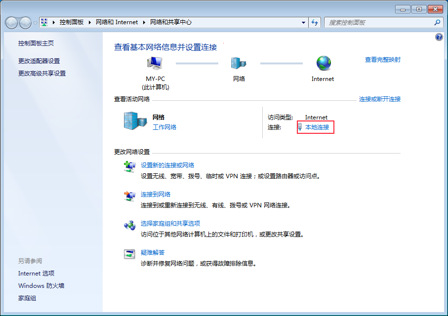
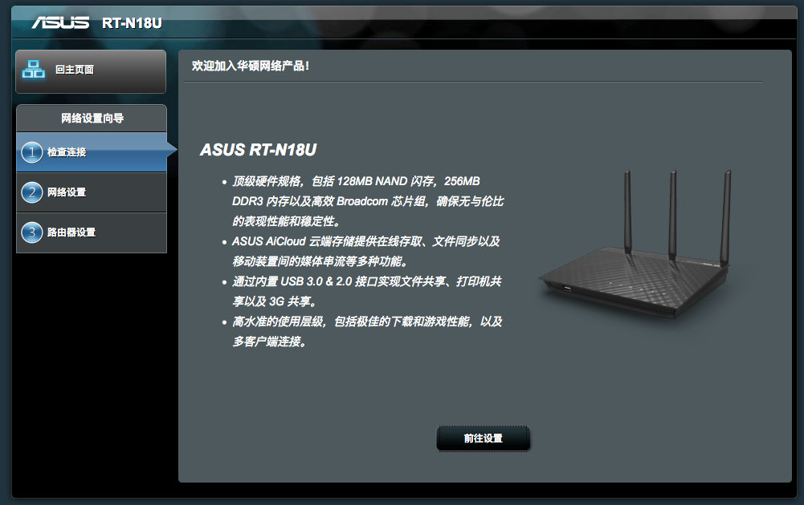
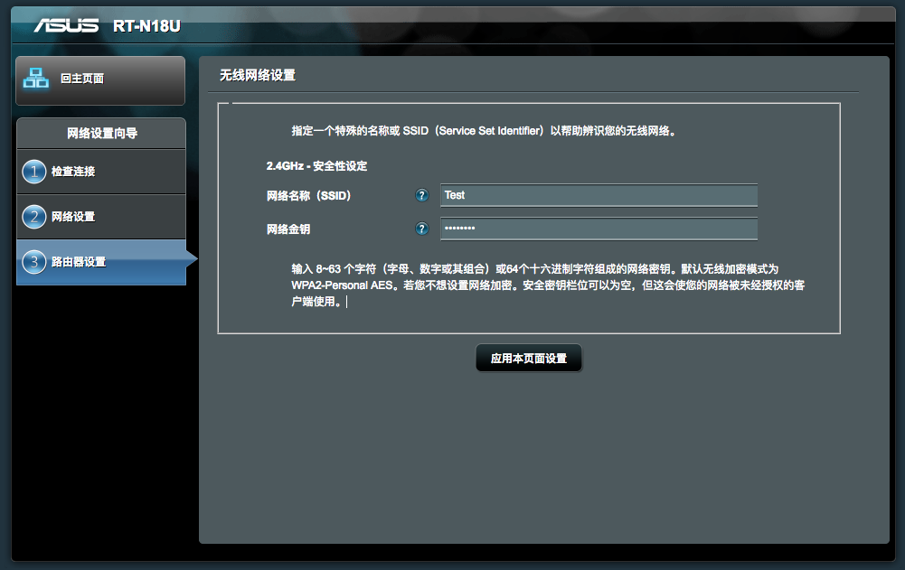
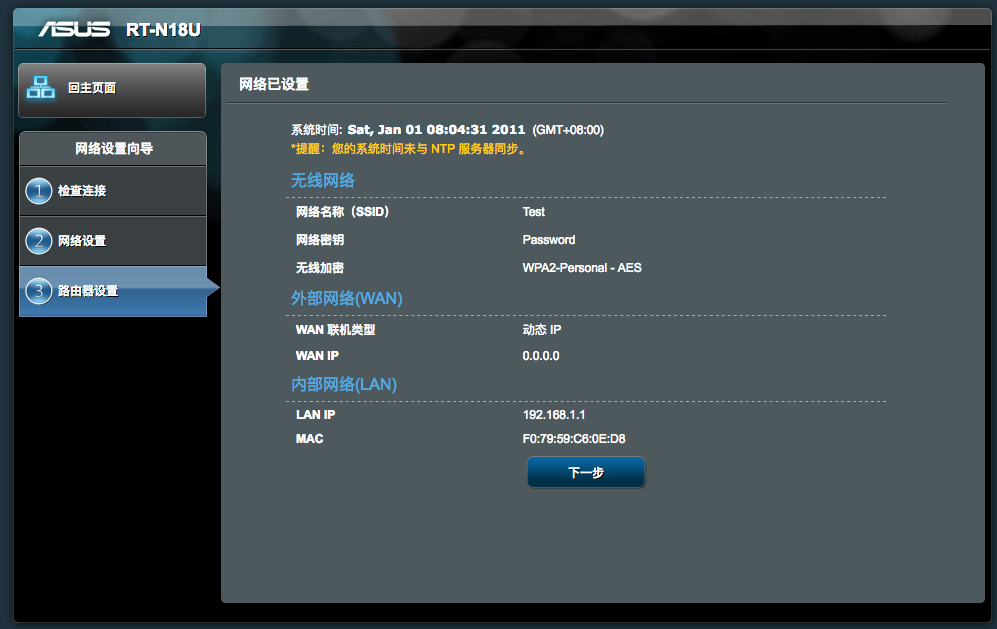
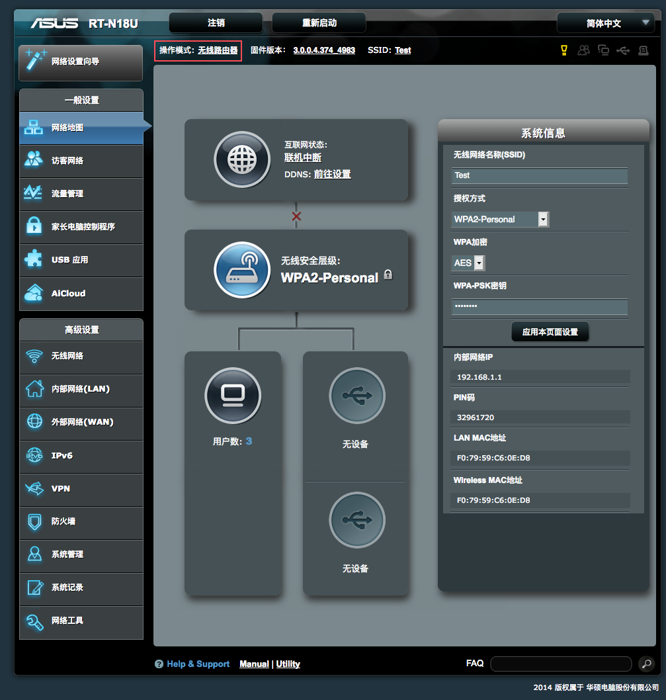
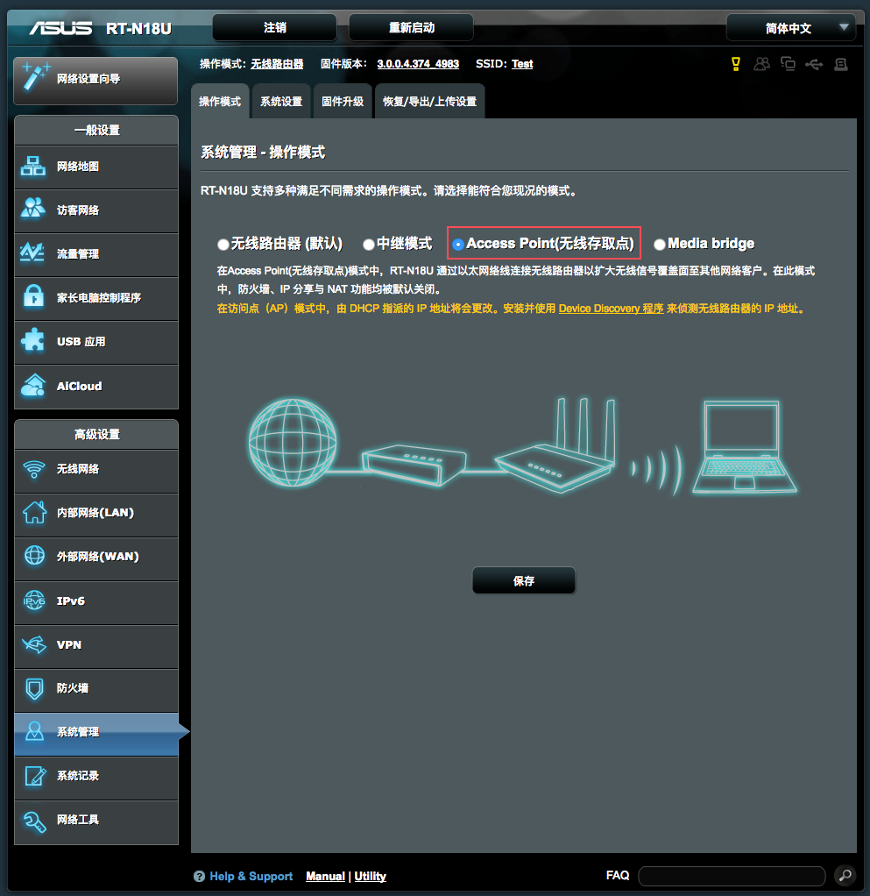
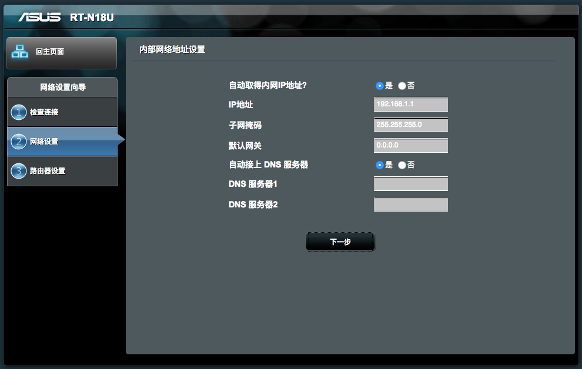
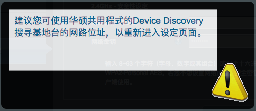
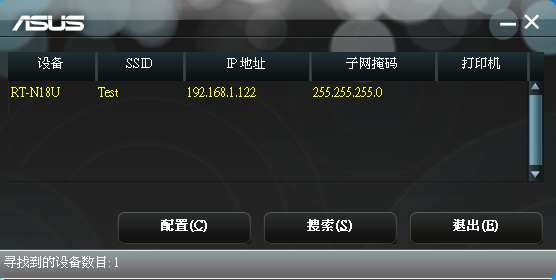

# Setup ASUS RT-N18U Wireless Router to AP Mode

## Part I - Set Static IP for Computer
* Goto "Control Panel" -> "Network and Sharing Center" -> "Local  Area Connection"

  
* Click "Properties"

  
* Double click "TCP/IPv4"

  
* Select "Use Static IP Address"
    * input a static IP **other than** `192.168.1.1`(e.g. `192.168.1.87`)
    * set subnet mask to `255.255.255.0`
    
  

## Part II - Configure Wireless Router
* Power on the router for the first time or keep pressing reset button to do a factory reset
* Connect the ethernet cable from computer to any one of **LAN**(yellow color) ports of the router
* Open a browser enter `192.168.1.1` to login the web admin page of the router
   * Username: `admin` 
   * Password: `admin`
   
  

* Click "Next" button to goto Wireless Settings
  * Input SSID(e.g. `Test`)
  * Input WPA2 password(e.g. `Password`)
  * Apply settings

  
  

* It'll show the main settings UI
* Click "Operation Mode"

  
* Set "Operation Mode" to "Access Point" mode

  
* Enable "DHCP" and confirm previous wireless settings

  
   
* Apply settings and you'll be notified that IP of the router will be changed due to DHCP

  
* Remove the ethernet cable from the computer and connect the cable to the switch and wait for a while
* Use another ethernet cable to connect from the computer to the swich
   ```
   +--------+  cable 1 +--------+     
   | switch |----------|Computer|
   |        |          +--------+
   |        |
   |        |  cable 2 +----------------------------+
   |        |----------|ASUS RT-N18U Wireless Router|
   +--------+          +----------------------------+
  ```
## Part III - Set DHCP Back for Computer
* Goto "Control Panel" -> "Network and Sharing Center" -> "Local  Area Connection"

  
* Click "Properties"

  
* Double click "TCP/IPv4"

  
* Select "Use DHCP"

  
   
## Part IV(Optional) - Find IP of the Router and Setup for the Future
* You need to download / run [ASUS Wireless Router Device Discovery Utility](https://dlsvr04.asus.com/pub/ASUS/wireless/4G-AC53U/Discovery_1482.zip) to get the IP of the router later

  
