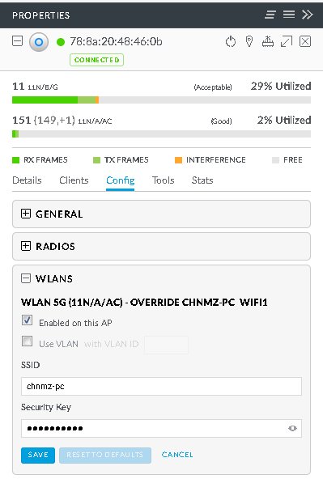

# Force UBNT UAP to USE 2G only

## Preparation
1. Download and run [Unifi Controller(SDN)](https://www.ubnt.com.cn/download/unifi)
2. Goto "Devices" -> Select the UAP -> "Config" -> "WLANS"
3. You may see 2 WLANS:
     * WLAN 2G
     * WLAN 5G

     

## Disable 5G for all WLANs
1. Goto "WLAN Group" of 5G and select "Off"

     

## Disable 5G for Specific WLAN
1. Goto "WLAN Group" of 5G and select one (`Default` by default)
2. You may see the WLANs listed
3. Click the "Override" icon(Pencil) of specific WLAN
4. Uncheck "Enabled on this AP" option

    

-----------------

# 强制UBNT UAP只使用2G

## 准备
1. 下载和运行[Unifi Controller(SDN)](https://www.ubnt.com.cn/download/unifi)
2. 进入"设备" -> 选择相应的UAP -> "配置" -> "WLANS"
3. 可以看见2个WLANS:
     * WLAN 2G
     * WLAN 5G

    

## 禁用所有WLAN的5G
1. 点击5G的"WLAN Group",选择"Off"

     

## 禁用所选WLAN上的5G
1. 进入5G的"WLAN Group",选择一个(默认为`Default`)
2. 你可以看见5G的WLAN列表
3. 在所选的WLAN右侧,点击"更改"图标(铅笔) 
4. 取消选择"Enabled on this AP"选项

     
