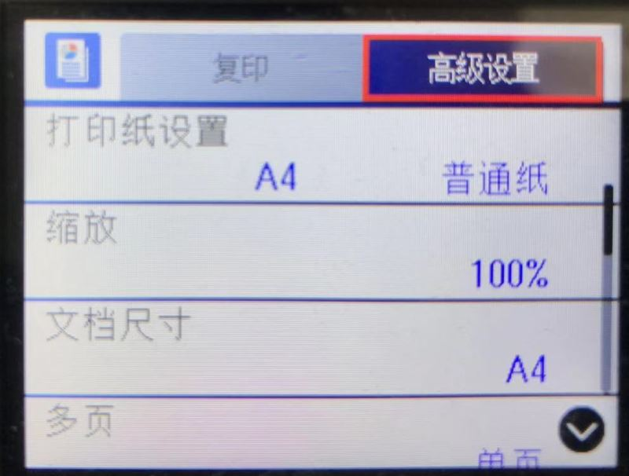
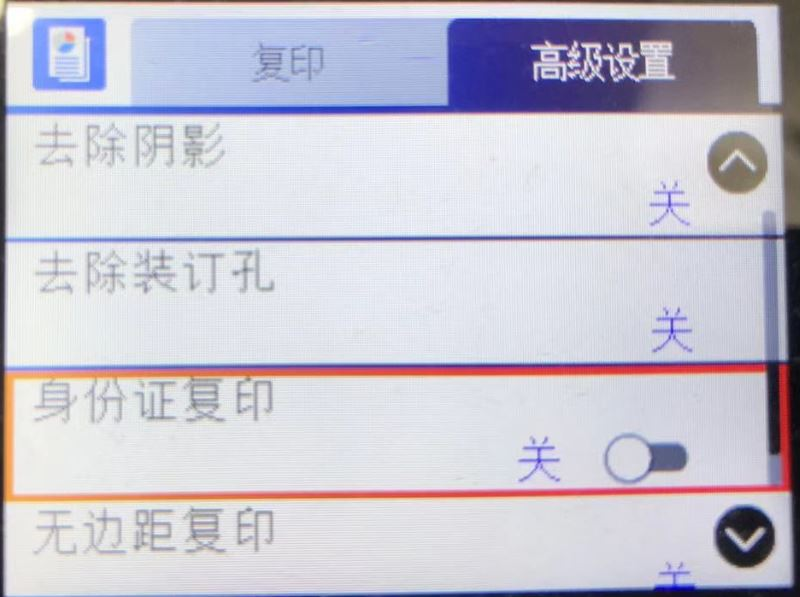
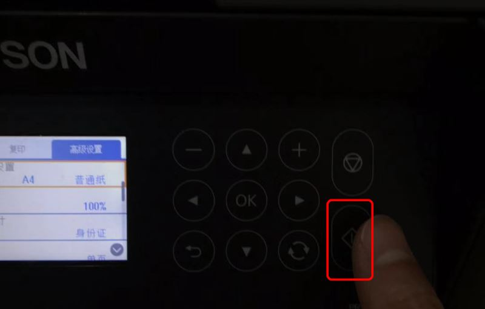
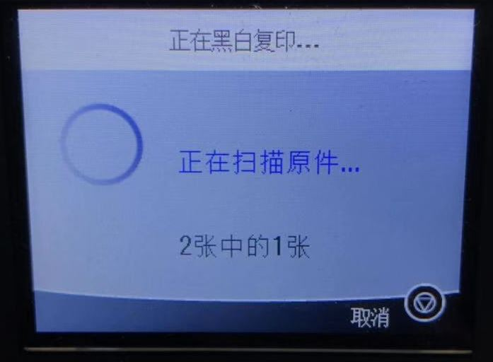
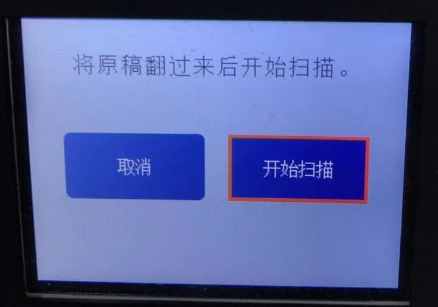

# Using Epson L6168 to Copy ID Card

## Steps
* Goto "Home" and select "Copy" and press "OK" button

   

* Select "Advanced Settings" on the right-top

   

* Turn on "ID Card Copy" option

   

   * Select "Close" to apply the changes
   
      

* Put ID card on the scanner

   

* Click "Start" button to start scanning

   

* It'll show "Scanning original... 1 of 2"

   

* After scanning is done, it'll show "Turn over the original and start scanning"

   

* Turn over the ID card and click "OK" button to start scanning

   

   

* It'll show "Printing... 1 of 1"

   

* Ouput paper looks like this

   

------

# 使用 Epson L6168 复印身份证的正反面到1张A4纸

## 步骤
* 在"主页"上选择"复印"，然后点击"OK"按钮

   

* 选择右上角的"高级"设置

   

* 打开"身份证复印"选项

   

   * 选择"关闭"来保存设置
   
      

* 将身份证放在扫描台面上

   

* 按"开始"按钮开始扫描

   

* 显示"正在扫描原件... 2张中的1张"

   

* 扫描一面结束后，提示"将原稿翻过来后扫描"

   

* 将身份证翻过来，按下"OK"按钮开始扫描

   

   

* 显示"正在打印... 1张中的1张"

   

* 输出的文稿

   

